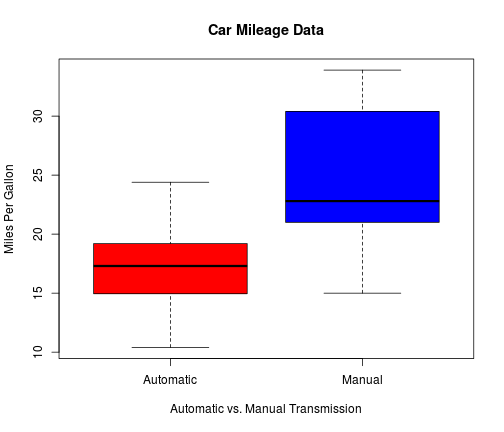

# The Impact of Transmission Type on Fuel Efficiency of Automobiles
### Author: Travis May

## Executive Summary
This report summarizes the impact of transmission type on fuel efficiency. The author uses a data set that Motor Trend Magazine construced in 1974, concerning the performance and attributes of 32 different models of vehicles across 11 variables. The study attempts to answer two questions as directed by Motor Trend Magazine: 1) is an automatic or manual transmission better for mpg and 2) what is the MPG difference between automatic and manual transmissions?

Using a linear model that measures the effect of the quantity of carbuerators, the number of cylinders, and whether the automobile has an automatic or manual transmission against the estimated mpg of a vehicle, the author finds that 


A cursory glance at the data shows that cars with manual transmissions get better gas mileage when compared to cars with automatic transmissions as illustrated by the following box plot.

 

A t-test can further illuminate this fact:

```
##          am   mpg
## 1 Automatic 17.15
## 2    Manual 24.39
```

### Regression Analysis
The initial linear model examines the interaction between transmission type and estimated milage per gallon, where 'mpg' represents miles per gallon and am is a dummy variable where a 1 represents a manual transmission .


```r
model <- lm(mpg ~ am, data=mtcars)
```

Vehicles with manual transmissions get 7.24 more miles per gallon on average. The initial model can explain approximately 33.8 percent of the variation in mpg. This isn't a particularly helpful model. It is necessary to investigate other variables.

```
## 
## Call:
## lm(formula = mpg ~ am, data = mtcars)
## 
## Residuals:
##    Min     1Q Median     3Q    Max 
## -9.392 -3.092 -0.297  3.244  9.508 
## 
## Coefficients:
##             Estimate Std. Error t value Pr(>|t|)    
## (Intercept)    17.15       1.12   15.25  1.1e-15 ***
## amManual        7.24       1.76    4.11  0.00029 ***
## ---
## Signif. codes:  0 '***' 0.001 '**' 0.01 '*' 0.05 '.' 0.1 ' ' 1
## 
## Residual standard error: 4.9 on 30 degrees of freedom
## Multiple R-squared:  0.36,	Adjusted R-squared:  0.338 
## F-statistic: 16.9 on 1 and 30 DF,  p-value: 0.000285
```

## Anova analysis:
An anova analysis is run to determine a model with a better fit.

The original model is compared against a model that contains all of the independent variables, as well as against one that examines carbeurators, cylinders and transmission.


```
## Analysis of Variance Table
## 
## Model 1: mpg ~ am
## Model 2: mpg ~ am + cyl + carb
## Model 3: mpg ~ cyl + disp + hp + drat + wt + qsec + vs + am + gear + carb
##   Res.Df RSS Df Sum of Sq     F  Pr(>F)    
## 1     30 721                               
## 2     28 212  2       508 36.19 1.6e-07 ***
## 3     21 147  7        65  1.32    0.29    
## ---
## Signif. codes:  0 '***' 0.001 '**' 0.01 '*' 0.05 '.' 0.1 ' ' 1
```
## Multivariate model:
The expanded model examines how carbeurators, cylinders and transmission can affect the estimated gas mileage of an automobile. As evident below, this model explains approximately 80 percent of the variation in gas mileage. With the addition of cylinders and carbeurators as independent variables, the effect of transmission is significantly reduced; from 7 mpg to 4 mpg.

```
## 
## Call:
## lm(formula = mpg ~ am + cyl + carb, data = mtcars)
## 
## Residuals:
##    Min     1Q Median     3Q    Max 
## -5.885 -1.158  0.265  1.488  5.484 
## 
## Coefficients:
##             Estimate Std. Error t value Pr(>|t|)    
## (Intercept)   32.173      2.491   12.91  2.6e-13 ***
## amManual       4.243      1.309    3.24  0.00307 ** 
## cyl           -1.717      0.430   -4.00  0.00042 ***
## carb          -1.130      0.406   -2.79  0.00948 ** 
## ---
## Signif. codes:  0 '***' 0.001 '**' 0.01 '*' 0.05 '.' 0.1 ' ' 1
## 
## Residual standard error: 2.75 on 28 degrees of freedom
## Multiple R-squared:  0.811,	Adjusted R-squared:  0.791 
## F-statistic: 40.1 on 3 and 28 DF,  p-value: 2.85e-10
```


 
